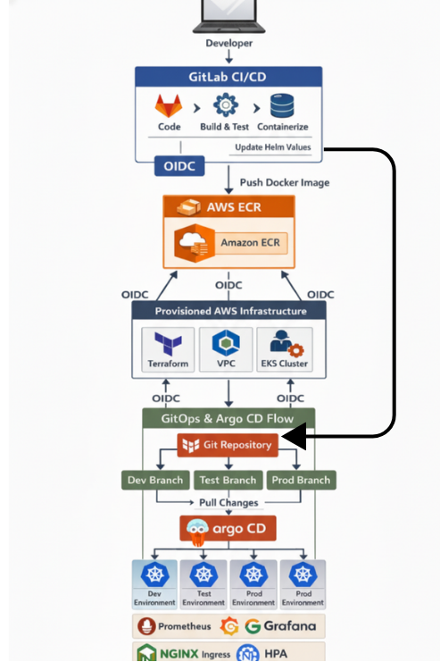
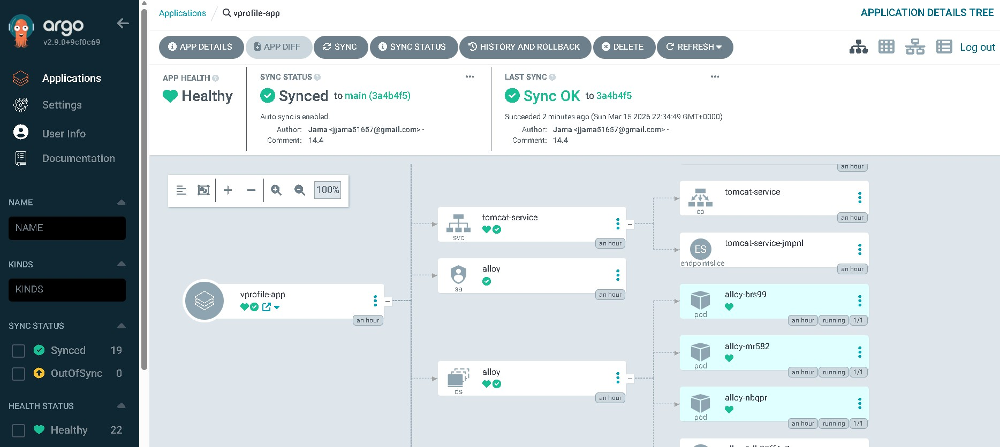

<h1>Java Microservice — GitOps CI/CD on AWS EKS</h1>

End-to-end DevOps pipeline deploying a Java application to AWS EKS using Terraform, GitLab CI/CD, ArgoCD, and a full observability stack.

<h2>🚀 Architecture Evolution</h2>

<h3>v1 – EC2-Based Monitoring (Pre-Kubernetes)</h3>
<ul>
<li>Deployed application on EC2</li>
<li>Manually installed Prometheus, Grafana, and Loki</li>
<li>Monitoring stack managed separately from application</li>
</ul>

<b>Problem:</b> High maintenance, not scalable, not cloud-native

<h3>v2 – Kubernetes Foundation (EKS via Terraform)</h3>
<ul>
<li>Provisioned EKS cluster using Terraform</li>
<li>Deployed workloads manually using <code>kubectl apply</code></li>
</ul>

<b>Problem:</b> Deployment process still manual and not reproducible

<h3>v3 – CI Integration (GitLab CI + OIDC)</h3>
<ul>
<li>Implemented GitLab CI pipeline</li>
<li>Used OIDC for secure AWS authentication</li>
<li>Automated build and push to ECR</li>
</ul>

<b>Progress:</b> CI achieved, but CD still manual

<h3>v4 – GitOps Adoption (ArgoCD)</h3>
<ul>
<li>Deployed ArgoCD using Terraform</li>
<li>Introduced GitOps workflow with separate repositories</li>
<li>Automatic sync based on branch changes</li>
</ul>

<b>Impact:</b> Fully automated, declarative deployments

<h3>v5 – Helm-Based Standardization</h3>
<ul>
<li>Replaced raw Kubernetes manifests with Helm charts</li>
<li>Introduced environment-based configuration (dev/test/prod)</li>
<li>Implemented branch-based promotion strategy</li>
</ul>

<b>Impact:</b> Reusable and scalable deployment model

<h3>v6 – Integrated Observability (Cloud-Native Approach)</h3>
<ul>
<li>Initially planned separate monitoring deployment</li>
<li>Shifted to container-native observability stack</li>
<li>Integrated Helm Chart with official images for Prometheus, Grafana, and Loki</li>
</ul>

<b>Insight:</b> Leveraging ecosystem-standard tooling improves consistency and maintainability

<h3>v7 – Production Enhancements</h3>
<ul>
<li>Implemented Horizontal Pod Autoscaler (HPA)</li>
<li>Added resource limits and requests</li>
<li>Integrated ExternalDNS for automated DNS management</li>
</ul>

<b>Impact:</b> Production-ready, scalable platform

<h3>📊 Final Outcome</h3>
<ul>
<li>Fully automated CI/CD + GitOps pipeline</li>
<li>Zero manual deployments</li>
<li>Unified infrastructure, deployment, and observability</li>
<li>Scalable and production-ready Kubernetes platform</li>
</ul>

<h2>Architecture Overview</h2>

<h2>Features</h2>

<ul>
<li><b>Infrastructure as Code</b> — VPC, EKS cluster, IAM roles, and ECR access provisioned entirely with Terraform</li>
<li><b>Secure CI/CD</b> — GitLab pipelines authenticated via OIDC (no long-lived credentials)</li>
<li><b>GitOps Delivery</b> — ArgoCD watches branches (<code>dev</code>, <code>test</code>, <code>main</code>) and deploys automatically</li>
<li><b>Environment Isolation</b> — Each environment maps to its own Kubernetes namespace</li>
<li><b>Observability Stack</b> — Prometheus, Grafana and Loki deployed via Helm</li>
<li><b>Automated DNS</b> — ExternalDNS automatically updates Route53 records</li>
<li><b>Autoscaling</b> — HPA scales pods automatically based on CPU/memory demand</li>
</ul>

<h2>Tech Stack</h2>

<table>
<tr>
<th>Area</th>
<th>Tools</th>
</tr>

<tr>
<td>Infrastructure</td>
<td>Terraform, AWS EKS, VPC, ECR, IAM</td>
</tr>

<tr>
<td>CI/CD</td>
<td>GitLab CI/CD, OIDC Authentication</td>
</tr>

<tr>
<td>GitOps</td>
<td>ArgoCD, Helm</td>
</tr>

<tr>
<td>Observability</td>
<td>Prometheus, Grafana, Loki</td>
</tr>

<tr>
<td>Networking</td>
<td>NGINX Ingress, ExternalDNS, Route53</td>
</tr>

<tr>
<td>Autoscaling</td>
<td>HPA</td>
</tr>

<tr>
<td>Language</td>
<td>Java</td>
</tr>
</table>

<h2>CI/CD Flow</h2>

<pre>
Code Push → GitLab CI
  → Build & Test Java app
  → Build Docker image
  → Push to ECR
  → Merge to dev/test/main branch
    → ArgoCD detects branch change
      → Deploys to namespace
        → ExternalDNS updates Route53
</pre>

<h2>Environment Strategy</h2>

<table>
<tr>
<th>Branch</th>
<th>Namespace</th>
<th>URL</th>
</tr>

<tr>
<td>dev</td>
<td>vprofile-dev</td>
<td>https://dev.tomcat.cutsopen.co.uk</td>
</tr>

<tr>
<td>test</td>
<td>vprofile-test</td>
<td>https://test.tomcat.cutsopen.co.uk</td>
</tr>

<tr>
<td>main</td>
<td>vprofile-prod</td>
<td>https://tomcat.cutsopen.co.uk</td>
</tr>
</table>

<h2>Infrastructure</h2>

<ul>
<li><b>VPC</b> — Custom VPC with public/private subnets across multiple AZs</li>
<li><b>EKS</b> — Managed node groups with <code>t3.small</code> instances (1–3 nodes autoscaling)</li>
<li><b>ECR</b> — Private container registry</li>
<li><b>IAM</b> — Least privilege roles for EKS nodes, ExternalDNS, and CI/CD</li>
</ul>

<h2>🚨 Incident Handling & Lessons Learned</h2>

<ul>
<li>Observed only 4 metrics in Grafana from Prometheus</li>
<li>Verified Prometheus scraping and app connectivity to the Java microservice</li>
<li>Discovered application error on the webpage prevented JMX exporter from exposing metrics</li>
<li>Checked Loki logs and realized metrics issue could have been detected earlier via logs</li>
<li>Root cause: Image pull failed due to lack of ECR permissions</li>
<li>Fixed Terraform policies to allow ECR access → redeployed container</li>
<li><b>Lesson learned:</b> Always check both logs and metrics when troubleshooting, as either alone may hide the root cause</li>
</ul>

<h2>Observability</h2>

<table>
<tr>
<th>Tool</th>
<th>Purpose</th>
<th>URL</th>
</tr>

<tr>
<td>Prometheus</td>
<td>Metrics scraping</td>
<td>Internal</td>
</tr>

<tr>
<td>Grafana</td>
<td>Dashboards</td>
<td>grafana.cutsopen.co.uk</td>
</tr>

<tr>
<td>Loki</td>
<td>Log aggregation</td>
<td>Internal</td>
</tr>
</table>

<h2>Project Structure</h2>

<pre>
TerraformEKS/
└── vprofile-project/
    ├── argocd-apps.tf    
    ├── argocd-outputs.tf
    ├── argocd.tf
    ├── eks-cluster.tf
    ├── external-dns.tf
    └── helm-provider.tf
    └── main.tf
    └── outputs.tf
    └── route53.tf
    └── terraform.tf
    └── terraform.tfvars.example
    └── variables.tf
    └── vpc.tf
K8CICD/
└── HelmCharts/
    └── tomcat-monitoring-chart/
        └── templates/
          └── apps/
              └── hpa.yaml
              └── ingress.yaml
              └── jmx-configmap.yaml
              └── tomcat-deployment.yaml
              └── tomcat-service.yaml
          └── monitoring/
              └── alloy-configmap.yaml
              └── alloy-daemonset.yaml
              └── alloy-rbac.yaml
              └── grafana-datasources.yaml
              └── grafana-deployment.yaml
              └── loki-configmap.yaml
              └── loki-deployment.yaml
              └── prometheus-configmap.yaml
              └── prometheus-deployment.yaml
          └── chart.yaml
          └── values.yaml
          └── _helpers.tpl
    └── AppCode/ (Commited to different Repo)
</pre>

<h2>Screenshots</h2>

<h3>ArgoCD — Application Sync</h3>

<h3>ArgoCD — Dev/Test/Prod Applications</h3>

<h3>Grafana Dashboard</h3>

<h3>GitLab CI Pipeline</h3>

<h3>AWS EKS Cluster</h3>

</tr>
</table>
